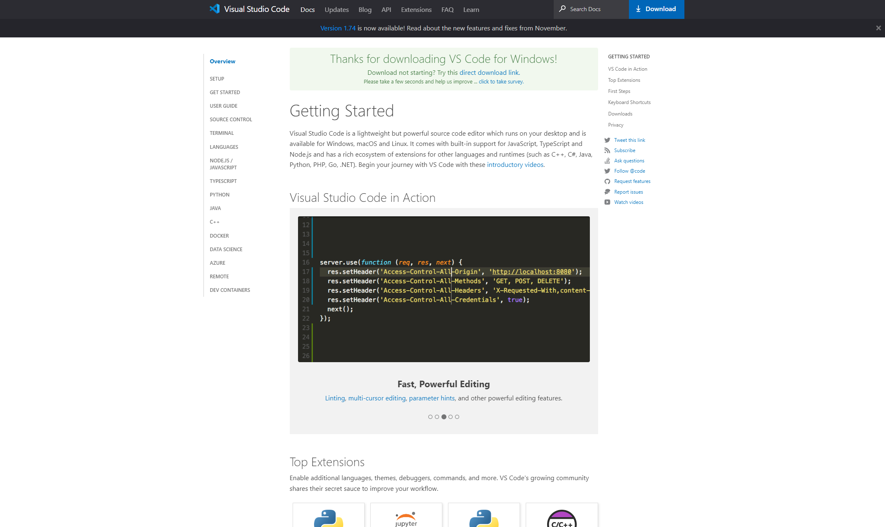

# Lab Report 1: Setting Up The Begining of CSE 15L Journey 
 
 
## Step 1: Installing Visual Studio Code and Setting Up The Enviroment 

Download the visual studio code if you still need to do so. Use this [link](https://code.visualstudio.com/) to get started. Click on download, and a page of instructions to get started will pop up. Follow the instruction and install the visual studio code. The page of instruction should like this after clicking download as shown below:



When you've downloaded the visual studio code, open it up, and it should look like this as shown below: 

.png)

Once you've downloaded the visual studio code, use his [link](https://gitforwindows.org/) to download git. To set up git, click next on everything except the default editor and change it to using visual studio code as the default editor. As shown below:  

.png)

Once you've installed git, open visual studio code, click on the terminal located on the top left bar, and then click on the new terminal. Then down at your terminal, find where there is a + sign. Next to it, there is a drop-down arrow. Click on it, then click on git bash, as shown below:

.png)

Once you've clicked on git bash, a terminal with a $ sign should pop up, as shown below. Now you're ready to give commands to your computer. The $ sign is a convention integrated in git bash terminal to write commands.

.png) 

## Step 2: Accessing Your CSE 15L Account 

In order to connect to the server, you must access your account. Use this [link](https://sdacs.ucsd.edu/~icc/index.php) to find your account. Enter your PID and
username. Under additional account, you have a course specific account and should start with cs15lwi23, follow by three letter which is different from each student. Click on it and then change your password. Note this will change your password globally and usually take 15 minuites to complete the change. 

.png) 
.png) 


## Step 3: Remote Connecting To UCSD Server 

After completing the password change, head back to visual art studio terminal where we set up git bash terminal. Type in ssh follow by your CS15L account @ieng6.ucsd.edu for example ``` $ssh cs15lwi23avi@ieng6.ucsd.edu ``` which should prompt a message like this one below:

> $ ssh cs15lwi23avi@ieng6.ucsd.edu
> 
> The authenticity of host 'ieng6.ucsd.edu (128.54.70.227)' can't be established.
> 
> RSA key fingerprint is ...
> 
> Are you sure you want to continue connecting (yes/no/[fingerprint])? 

Type in yes and will prompt to tell you to enter the password. Note that the password can't be seen when typed. If you type in the right password, but still can't log in then wait and try again. When you logged in, the following message will appear and that means your connected:

.png) 

## Step 4: Running Commands  


Now that your connected lets run some commands on the server. Here is a list of commands:
- cd <path> (switch the current working directory)
- cd ~ (switch to home directory)
- ls -a (shows list of all files in the server)
- ls -lat (shows list of all files in complete detail) 
- cp /home/linux/ieng6/cs15lwi23/public/hello.txt ~/ (copy a file in a given path)
- cat /home/linux/ieng6/cs15lwi23/public/hello.txt (prints the content of files of the given path in this case Hello! Welcome to CSE15L)
- exit (log out the server)

Here is an example of the above commands running: 
.png)

