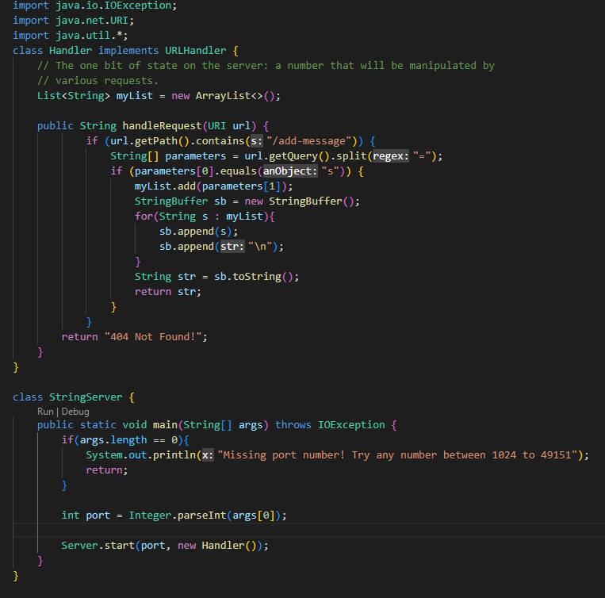
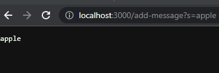
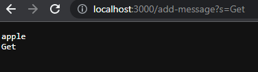

# Lab Report 2: Server and Bugs

## Part One: StringServer
- ```StringServer``` Code 



- Using the ```/add-message``` commands
  - ```/add-message?s=apple```
  
  
  
  The methods called in the code of ```StringServer``` to excute the command of ```/add-message?s=apple``` which is shown above is the ```handleRequest``` method in which takes the parameter of the ```url``` and checks if the ```url``` contains ```/add-message?s=apple```. If it does, then after the query which is the ```?``` it will split the ```"s"``` and ```"apple"``` which is separated by the ```=``` into two separate ```parameter``` in a ```String``` array called ```parameters```.  Then checks if the ```parameters[0]``` is ```"s"``` and if so it will assign the ```"apple"``` into a arraylist called ```myList``` which acts a memory storage for all ```/add-message?s=<string>``` used storing only the ```<string input>```. Then it uses ```StringBuffer``` to build the message using a loop to run through ```myList``` taking each ```String``` within ```myList``` then ```append``` to ```sb``` a ```StringBuffer``` and also ```append("\n")``` to ```sb``` which ```"\n"``` just makes a new line to sperate each ```String``` which is shown below in using ```/add-message?s=Get``` after using this command. Then converts ```StringBuffer``` to a ```String``` in varible called ```str``` then it returns ```str``` on the page as shown in the screenshot which ```str``` was ```apple```.  
  
  - ```/add-message?s=Get```
  
  
  
  Similar to the above description of using ```/add-message?s=apple``` except that ```handleRequest``` is called again when excuting ```/add-message?s=Get``` which clears all vaules within the method but doesn't clear ```myList``` since it is a instance varible not within the method but instead in the class. The method returns the previous string ```"apple"``` which is already stored in ```myList``` from the previous command above with the newly added string ```"Get"``` as shown above screenshot. Also ```"Get"``` is stored in ```myList"``` which changes ```myList``` to contain a list ```["apple", "Get"]```. 

## Part Two: Symptom and Bugs 
-

### Code Before Fixing The Bug And After Fixing The Bug 


## Part Three: Reflection
Things I learned in this lab that I didn't learned before was JUnit Testing and creating URL website. I learned how to write test code using assert methods to debug and diagnose symptom in the code work which I then applied into CSE12 PA2 where we start to use JUnit testing and implement hidden test. I also learned to create URL website from VS code and creating functions to add on to the site using comands in the URL interface. 

