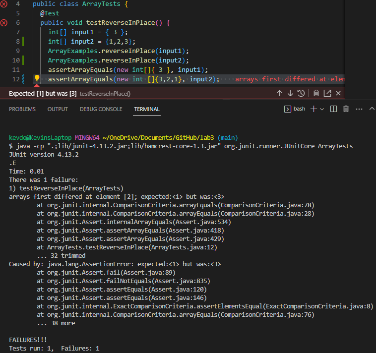

# Lab Report 2: Server and Bugs

## Part One: StringServer

- ```StringServer``` Code 


- Using the ```/add-message``` commands
  - ```/add-message?s=apple```
  
  
  
  The methods called in the code of ```StringServer``` to excute the command of ```/add-message?s=apple``` which is shown above is the ```handleRequest``` method in which takes the parameter of the ```url``` and checks if the ```url``` contains ```/add-message?s=apple```. If it does, then after the query which is the ```?``` it will split the ```"s"``` and ```"apple"``` which is separated by the ```=``` into two separate ```parameter``` in a ```String``` array called ```parameters```.  Then checks if the ```parameters[0]``` is ```"s"``` and if so it will assign the ```"apple"``` into a arraylist called ```myList``` which acts a memory storage for all ```/add-message?s=<string>``` used storing only the ```<string input>```. Then it uses ```StringBuffer``` to build the message using a loop to run through ```myList``` taking each ```String``` within ```myList``` then ```append``` to ```sb``` a ```StringBuffer``` and also ```append("\n")``` to ```sb``` which ```"\n"``` just makes a new line to sperate each ```String``` which is shown below in using ```/add-message?s=Get``` after using this command. Then converts ```StringBuffer``` to a ```String``` in varible called ```str``` then it returns ```str``` on the page as shown in the screenshot which ```str``` was ```apple```.  
  
  - ```/add-message?s=Get```
  
  
  
  Similar to the above description of using ```/add-message?s=apple``` except that ```handleRequest``` is called again when excuting ```/add-message?s=Get``` which clears all vaules within the method but doesn't clear ```myList``` since it is a instance varible not within the method but instead in the class. The method returns the previous string ```"apple"``` which is already stored in ```myList``` from the previous command above with the newly added string ```"Get"``` as shown above screenshot. Also ```"Get"``` is stored in ```myList"``` which changes ```myList``` to contain a list ```["apple", "Get"]```. 

## Part Two: Symptom and Bugs 

- Failure-inducing input
> @Test 
> public void testReverseInPlace() {
>   int[] input2 = {1,2,3};
>   ArrayExamples.reverseInPlace(input2);
>   assertArrayEquals(new int []{3,2,1}, input2);
> }

- Not a failure-inducing input 
> @Test 
> public void testReverseInPlace() {
>   int[] input1 = {3};
>   ArrayExamples.reverseInPlace(input1);
>   assertArrayEquals(new int []{3}, input1);
> }

- Symptom of running the code 



- Before code change required to fix bug 
>  static void reverseInPlace(int[] arr) {
>   for(int i = 0; i < arr.length; i += 1) {
>     arr[i] = arr[arr.length - i - 1];
>   }
>  }

- After code change required to fix bug 
> static void reverseInPlace(int[] arr) {
> int[] reversedArr = new int[arr.length];
> for(int i = 0, j = arr.length - 1; j>=0; i++, j--){
>     reversedArr[i] = arr[j];
>   }
> for(int i =0; i<arr.length; i++){
>      arr[i] = reversedArr[i];
>   }
> }


The fix as shown above address the issue of the bug because the original or before ```reverseInplace()``` replaces elements in reverse order without preserving the original elements so it doesn't reverse. For example in the before an input of ```{1,2,3}``` it replaces 1 with 3 but after that it doesn't assign index 2 to 1 because index 0 is not 1 anymore rather 3. In the after code change as shown above, there is a new array called ```reversedArr``` that runs through a loop that takes ```arr``` from the ending index to the start copies over to the ```reversedArr``` in reverse order. Then another loop to copy the contents of ```reversedArr``` to ```arr``` to fix the bug. The bug was basically trying to reverse ```arr``` within ```arr``` but it affects the whole array soyou need to make another array to store the values without changing them. 

## Part Three: Reflection
Things I learned in this lab that I didn't learned before was JUnit Testing and creating URL website. I learned how to write test code using assert methods to debug and diagnose symptom in the code work which I then applied into CSE12 PA2 where we start to use JUnit testing and implement hidden test. I also learned to create URL website from VS code and creating functions to add on to the site using comands in the URL interface. 

