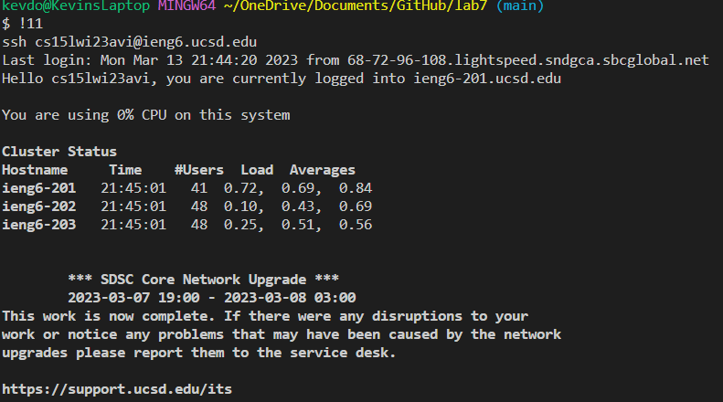
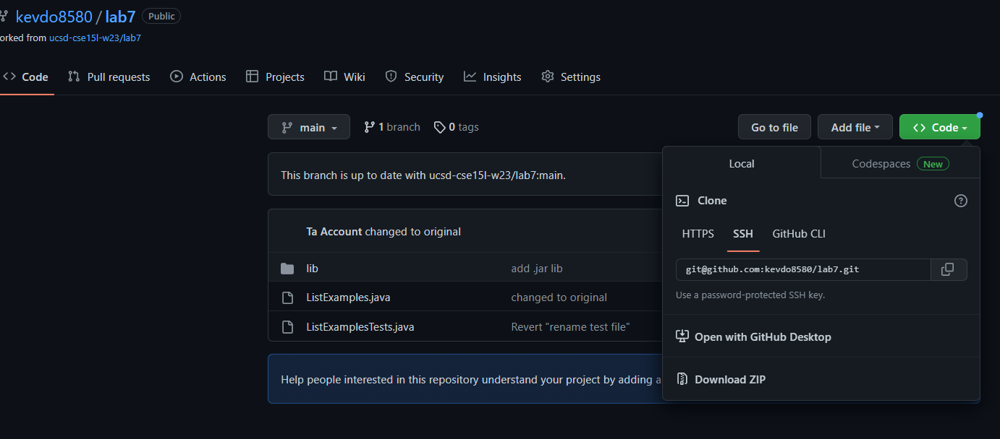
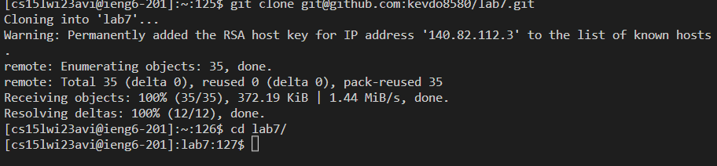
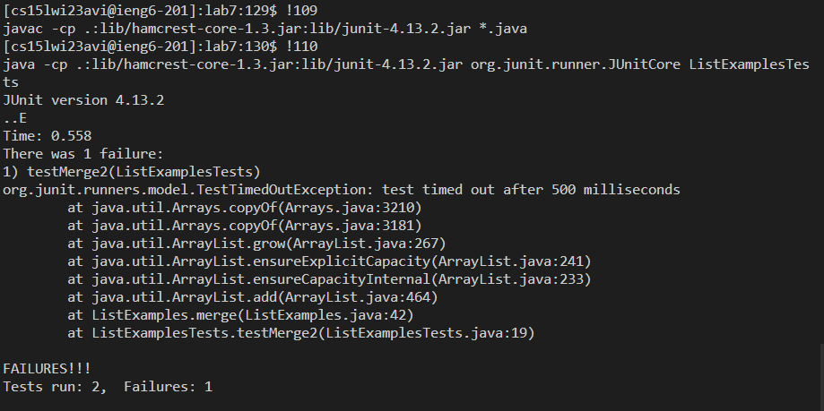
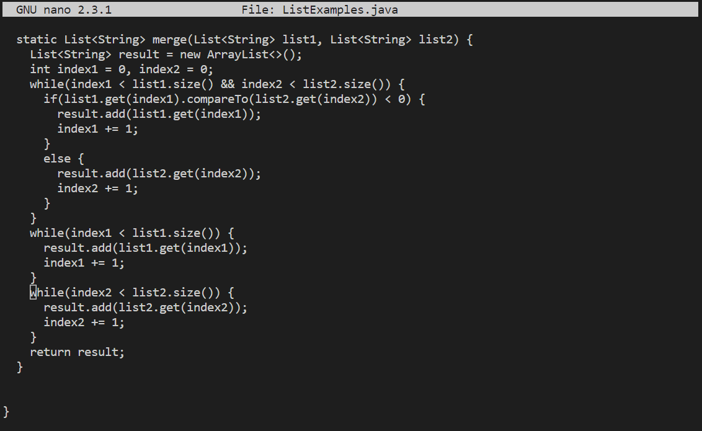
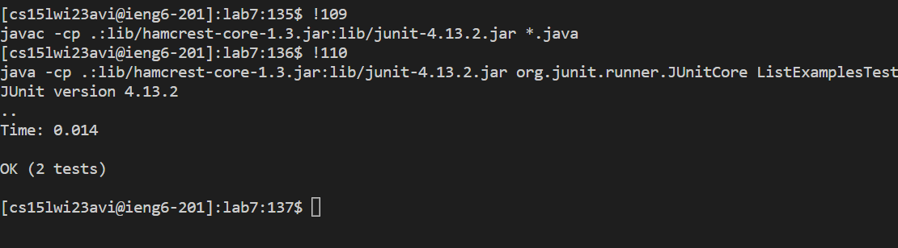
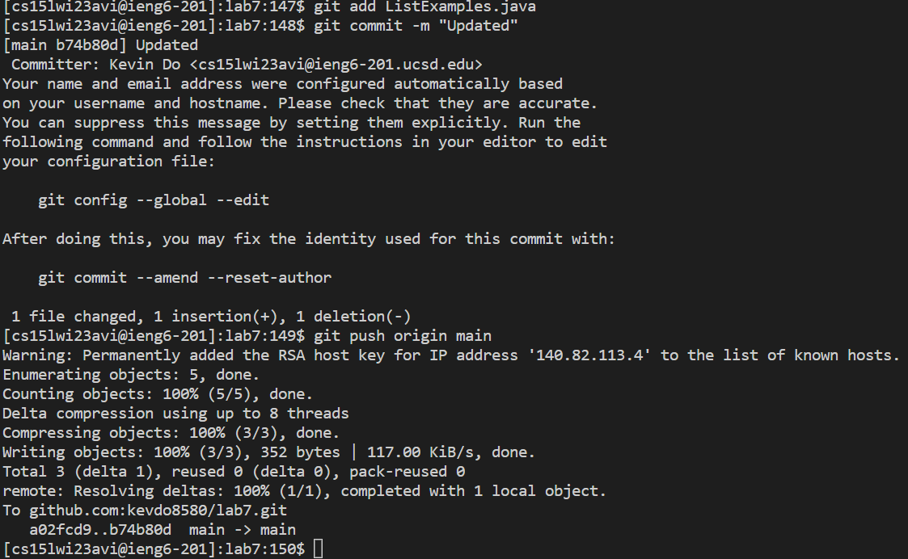
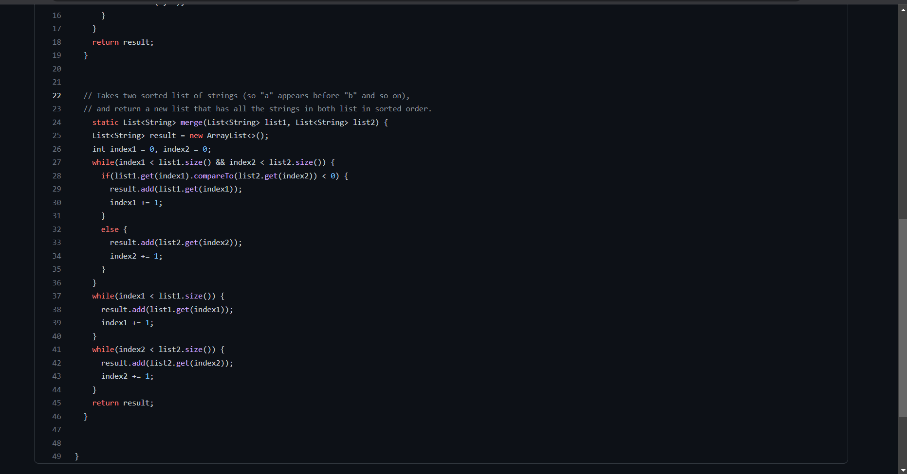

# Lab Report 4: "Done Quick" 

## Step One: Log into ieng6 



Typed in ```!11``` in bash terminal as the numerical value in history of the current home directory for the command of ```ssh cs15lwi23avi@ieng6.ucsd.edu``` then pressed ```<enter>```. As shown above. The command ```![Numerical Input]``` execute past command based on the order of commands execute in the history.

## Step Two: Clone fork repository from Github Account



Get the ssh key and copy it by pressing the copy icon in the image above. Go to bash terminal where you are logged in to the account and type in ```git clone <ctrl-v> <enter>```. Then ```cd l<tab>``` to autofill into ```cd lab7/``` and ```<enter>``` to execute. This will clone the repository of Lab7 to your ieng6 account and make sure to always change your directory to the file clone since you will be working on it as shown below.



## Step Three: Run Test and Demonstrate Fail



Typed in ```!109 <enter>``` as command ```!109``` was in search history to compile the file for test and ```!110 <enter>``` as command ```!110``` was in search history to run the test. ```![Numerical Value]``` command allows you to use a specific command you used in the past history. In which case we compile the test lib and run the test file as shown above 

## Step Four: Edit The Code



Typed in ```nano L<tab>.j<tab> <enter>``` to auto fill into ```nano ListExamples.java``` in order to open the editor and to start debugging. ```<ctrl +w>``` typed in ```while(index2 <enter>``` to find the while loop that was causing the problem without holding down the ```<down>``` key to get to it. ```<down> <down> <right> <right> <right> <right> <right> <right> <right> <right> <delete/backspace> 2 <ctrl + o> <enter> <ctrl + x> <enter>``` to delete the 1 in ```index1``` and replace with 2 to make it ```index2``` then save and exit as shown above.

## Step 5: Run The Tests and Demonstrate Success 



Typed in ```!109 <enter>``` as command ```!109``` was in search history to compile the file for the test and ```!110 <enter>``` as command ```!110``` was in search history to run the test. As shown above and it is using the same command as in step three. This will compile and run the test lib and file. 

## Step 6: Commit and Push 



Typed in ```git add L<tab>.j<tab> <enter>``` which basically adding changes in working directory to ```git commit```. Then typed ```git commit -m “Updated” <enter>``` this will prompt ```Updated``` if the ```git commit``` is successful and will record the change of the ```git add [File]```. Then typed in ```git push origin main <enter>``` which will push the recorded change from ```git commit``` to the remote repository. As shown above.

 

The changes will now appear into the lab7 repository under ListExamples.java as shown above.


